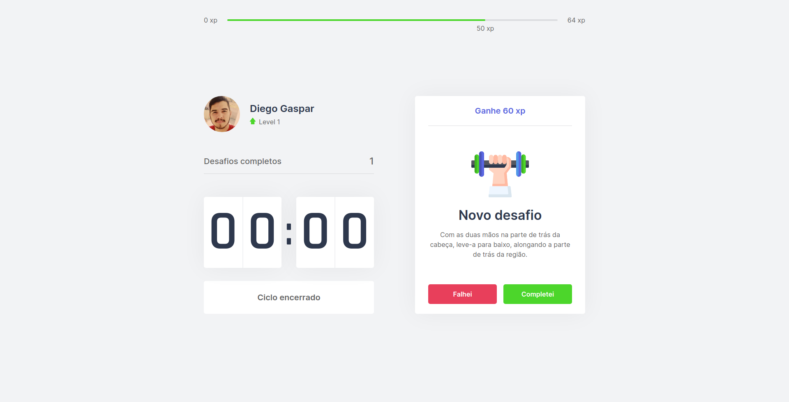

<div align="center">
  
  <br/><br/>
  
</div>

## 📃 About

**Move.it** is an app that uses the [pomodoro](https://pt.wikipedia.org/wiki/T%C3%A9cnica_pomodoro) technique, in order to improve your productivity and focus. Developed during the **Next Level Week**, an online event produced by [**Rocketseat**](https://github.com/Rocketseat).

## 🖥 Tecnologies

<div>
  <br />
  <a href="#-tecnologias-utilizadas">
      
      
      
   </a>
</div>

This project was developed using cutting edge front-end technologies.

- [ReactJS](https://reactjs.org/)
- [Typescript](https://www.typescriptlang.org/)
- [Next.js](https://nextjs.org/)
- [JavaScript Cookie](https://github.com/js-cookie/js-cookie)

## 🚀 Getting started

### Requirements

- You need to install both [Node.js](https://nodejs.org/en/download/) and [Yarn](https://yarnpkg.com/) to run this project.

**Clone the project and access the folder**

```bash
$ git clone https://github.com/diegogasparcruz/moveit.git && cd moveit
```

**Follow the steps below**

```bash
# Install the dependencies
$ yarn

# Run the web server
$ yarn dev
```

The app will be available for access on your browser at `http://localhost:3000`
